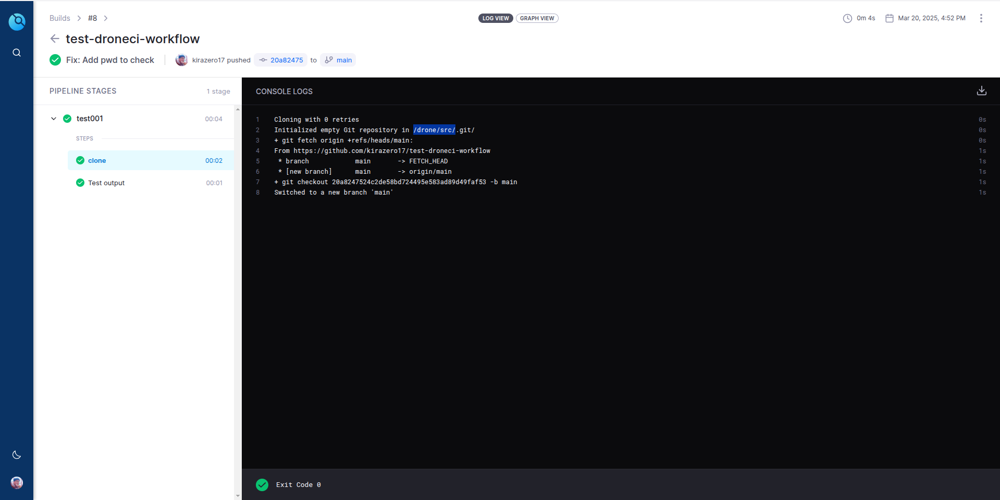

# test-droneci-workflow
A code repo to test the DroneCI workflow

I will also tell you things that the offical documents do not say, but you can see here and there:

1. The source code will be cloned to `/drone/src/` and your working directory is redirected to it. So no matter where your workflow YAML file is, the default current folder of the command is always the root of the repository (`/drone/src/`).

